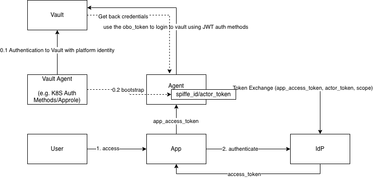

# Agentic Control Plane

**Description**: This github repository explore how you can use HashiCorp Vault and IdP in an OBO Token Exchange flow.

It aims to solve a few problems:
    1. Bootstrapping of Agent Identities
    2. Traceability, Accountability and Auditability of the Agent

## Architecture Diagram



## Vault Configuration

The steps below assume Vault Enterprise is already running and unsealed (see
[`vault/vault_setup.sh`](vault/vault_setup.sh) for the container bootstrap),
and that you authenticate via the **Kubernetes auth method** so each chatbot
pod proves its own identity — no AppRole secret-id on disk.

### 1. Export environment

```bash
export VAULT_ADDR=http://127.0.0.1:8200
export VAULT_TOKEN=<root-or-admin-token>
```

### 2. Write the chatbot policy

Grants the role permission to read/mint SPIFFE JWTs for `role-chatbot`.

```bash
cat <<EOF | vault policy write chatbot-policy -
# Read and mint SPIFFE JWTs
path "spiffe/role/role-chatbot/*" {
  capabilities = ["read", "list", "update"]
}
EOF
```

### 3. Enable & configure the Kubernetes auth method

This replaces AppRole. The pod's projected ServiceAccount token (rotated
automatically by the kubelet) is what authenticates it to Vault.

```bash
vault auth enable kubernetes

vault write auth/kubernetes/config \
    kubernetes_host="https://kubernetes.default.svc" \
    kubernetes_ca_cert=@/var/run/secrets/kubernetes.io/serviceaccount/ca.crt
```

Bind a role to the chatbot ServiceAccount/namespace:

```bash
vault write auth/kubernetes/role/chatbot \
    bound_service_account_names=chatbot \
    bound_service_account_namespaces=chatbot \
    token_policies=chatbot-policy \
    token_ttl=1h \
    token_max_ttl=4h
```

Capture the mount accessor — the SPIFFE template needs it to read pod
metadata that Kubernetes auth attaches to the entity alias:

```bash
export K8S_ACCESSOR=$(vault auth list -format=json | jq -r '.["kubernetes/"].accessor')
```

### 4. Enable the SPIFFE secrets engine

```bash
vault secrets enable spiffe
```

Configure the trust domain. `issuer` is the public URL where Vault's SPIFFE
JWKS is reachable (e.g. an ngrok tunnel for local demos):

```bash
export ISSUER="https://<your-public-host>/v1/spiffe"

vault write spiffe/config \
    trust_domain=example.org \
    jwt_issuer_url="$ISSUER"
```

### 5. Create the SPIFFE role with pod-aware templating

The `sub` claim is rendered at mint time from the calling pod's alias
metadata, producing `spiffe://example.org/ns/<namespace>/<pod-name>`.

```bash
vault write spiffe/role/role-chatbot \
    template='{"sub": "spiffe://example.org/ns/{{identity.entity.aliases.'"$K8S_ACCESSOR"'.metadata.service_account_namespace}}/{{identity.entity.aliases.'"$K8S_ACCESSOR"'.metadata.pod_name}}"}' \
    ttl=1m \
    use_jti_claim=true
```

### 6. Mint a SPIFFE JWT (from the pod)

The pod logs in with its projected SA token, then mints a short-lived
SPIFFE JWT. Run this **inside the pod**:

```bash
SA_JWT=$(cat /var/run/secrets/kubernetes.io/serviceaccount/token)

export VAULT_TOKEN=$(vault write -field=token \
    auth/kubernetes/login role=chatbot jwt="$SA_JWT")

vault write -field=token spiffe/role/role-chatbot/mintjwt \
    audience=vault > /app/spiffe-jwt.txt
```

### 7. Publish the SPIFFE OIDC discovery endpoints

Relying parties verify the JWT using Vault's JWKS:

```bash
vault write identity/oidc/config issuer="$ISSUER"

# Discovery URL: $ISSUER/.well-known/openid-configuration
# JWKS URL:      $ISSUER/.well-known/keys
curl -s "$ISSUER/.well-known/keys"
```

### 8. Configure the inbound JWT auth method (user OBO)

Lets Vault accept user identity tokens from the IdP (IBM Verify) so the
chatbot can perform on-behalf-of token exchange.

```bash
vault auth enable jwt

vault write auth/jwt/config \
    oidc_discovery_url="https://test-demo-2020.verify.ibm.com/oidc/endpoint/default" \
    bound_issuer="https://test-demo-2020.verify.ibm.com/oidc/endpoint/default"

vault write auth/jwt/role/chatbot-role \
    role_type="jwt" \
    policies="chatbot-policy" \
    user_claim="sub" \
    bound_audiences="vault" \
    bound_claims_type="glob" \
    bound_claims='{"sub":"spiffe://example.org/ns/chatbot/*"}' \
    token_ttl=1h \
    token_max_ttl=4h
```

> **Note:** Vault's `bound_subject` is exact-match only and does not support
> wildcards. To match every pod under `ns/chatbot/`, use `bound_claims` with
> `bound_claims_type="glob"` as shown above. Adjust the pattern (e.g.
> `chatbot-*`) to tighten matching.

